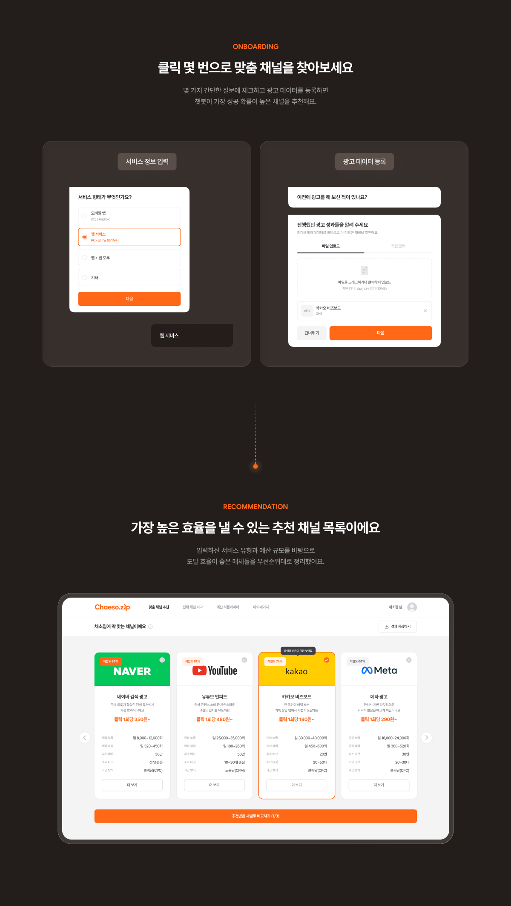
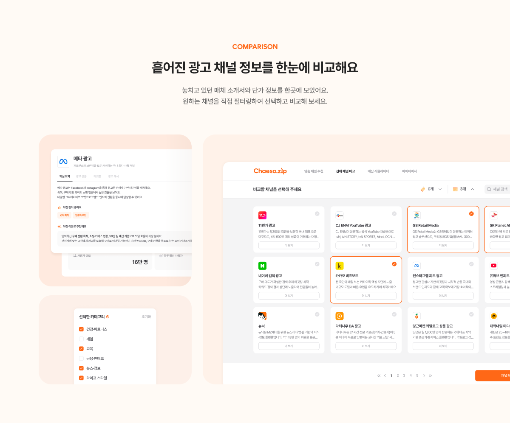
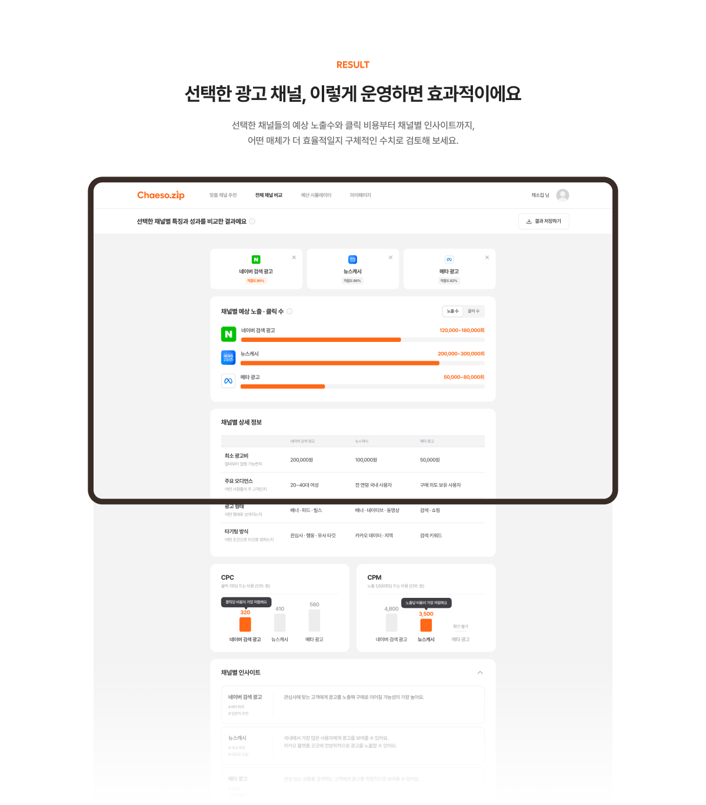
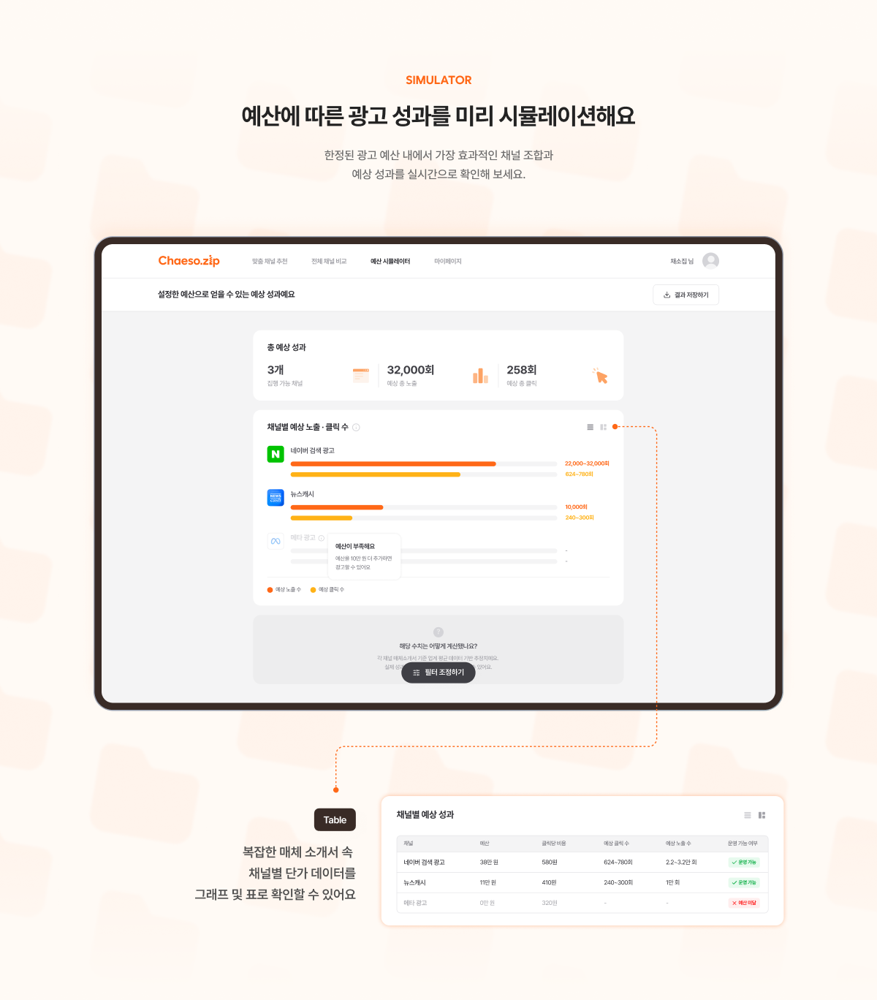
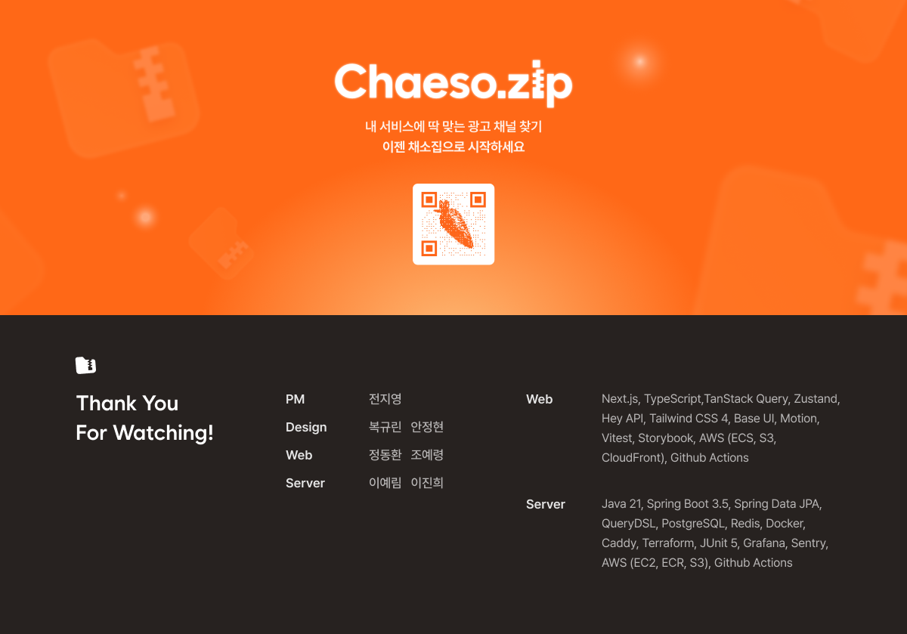

<p align="center">
  <a href="https://chaeso-zip.com">
    
  </a>
</p>

<h1 align="center">채소ZIP</h1>

<p align="center">
  <strong>당신의 광고, 제철 채널로 채우세요</strong><br />
  내 서비스에 맞는 광고 채널을 추천받고, 비교하고, 예산별 예상 성과까지 확인해 보세요.
</p>

<p align="center">
  <a href="https://chaeso-zip.com">서비스 바로가기</a>
  ·
  <a href="https://github.com/YAPP-Github/28th-Web-Team-4-FE/actions/workflows/ci.yml">
    
  </a>
</p>

## 내게 맞는 광고 채널을 한눈에

채소ZIP은 광고 채널 탐색부터 비교, 예산별 성과 예측까지 한곳에서 돕는 광고 채널 선택 서비스입니다. 서비스의 업종·형태·타깃·목표·예산을 입력하면 조건에 맞는 채널을 찾고, 주요 지표를 비교해 광고 계획을 구체화할 수 있습니다.

<p align="center">
  
</p>

## 서비스 정보를 입력하면 맞춤 채널을 추천해요

간단한 서비스 정보와 광고 데이터를 입력하면 조건에 적합한 광고 채널과 추천 이유를 확인할 수 있습니다. 로그인한 사용자는 추천 결과를 저장해 다시 확인할 수 있습니다.

<p align="center">
  
</p>

## 필요한 채널만 골라 한눈에 비교해요

조건에 맞는 광고 채널을 탐색하고 최대 3개까지 선택할 수 있습니다. 채널별 최소 광고비, 주요 오디언스, 광고 형태와 과금 방식을 살펴보며 비교 대상을 좁혀 보세요.

<p align="center">
  
</p>

예상 노출과 클릭, CPC·CPM을 나란히 확인하고 지표별 인사이트를 바탕으로 채널을 선택할 수 있습니다. 비교 결과도 저장해 필요할 때 다시 확인할 수 있습니다.

<p align="center">
  
</p>

## 예산에 따른 성과를 미리 살펴봐요

채널별 예산을 조정하면서 예상 노출과 클릭의 변화를 확인하고, 결과를 그래프와 표로 비교할 수 있습니다.

<p align="center">
  
</p>

> [!TIP]
> 로그인 사용자는 추천·비교·시뮬레이션 결과를 각각 저장해 다시 확인할 수 있습니다. 저장한 추천 결과의 채널을 불러오면 예산 시뮬레이션을 바로 이어서 진행할 수 있습니다.

> [!NOTE]
> 예상 성과는 매체 정보와 입력 조건을 바탕으로 계산한 참고값이며 실제 광고 성과를 보장하지 않습니다.

## Engineering Highlights

- **Feature-Sliced Design** — Next.js App Router 진입점은 얇게 유지하고, 페이지·사용자 행동·공통 모듈의 책임을 분리해 단방향 의존성을 유지합니다.
- **Design Token Pipeline** — Tokens Studio의 토큰을 Style Dictionary로 변환해 Tailwind CSS 4의 `@theme` 변수로 사용하고, 생성과 검증 및 PR 과정을 자동화했습니다.
- **Type-safe API Client** — Hey API 기반으로 OpenAPI 명세에서 TypeScript 타입·SDK·TanStack Query 코드를 생성하고, 명세 변경 시 GitHub Actions가 자동 PR을 생성합니다.
- **Continuous Delivery** — `main` 브랜치 변경 시 Doppler 환경에서 Next.js를 빌드하고, 정적 자산은 Amazon S3에 동기화하며 ARM64 컨테이너 이미지는 Amazon ECR을 거쳐 ECS Fargate에 배포합니다.
- **Motion & Interaction** — Motion for React와 CSS 전환으로 스크롤 스토리텔링과 주요 상태 변화를 구현하고, 사용자의 reduced-motion 설정을 지원합니다.

자세한 구조와 규칙은 [아키텍처 문서](./docs/architecture.md), 디자인 토큰 흐름은 [디자인 토큰 문서](./design-tokens/README.md)에서 확인할 수 있습니다.

## Tech Stack

| 영역       | 기술                                                                  |
| ---------- | --------------------------------------------------------------------- |
| Core       | Next.js 16, React 19, TypeScript 6                                    |
| UI         | Tailwind CSS 4, Base UI, Style Dictionary, Motion                     |
| Data / API | TanStack Query, Zustand, ky, zod, React Hook Form, Hey API OpenAPI TS |
| Delivery   | Doppler, GitHub Actions, Amazon S3, ECR, ECS Fargate                  |

## 시작하기

### 사전 준비

- [mise](https://mise.jdx.dev/)가 설치되어 있어야 합니다.
- Doppler CLI와 팀 프로젝트의 `dev` 환경 접근 권한이 필요합니다.

### 1. 저장소와 의존성 설치

```bash
git clone https://github.com/YAPP-Github/28th-Web-Team-4-FE.git
cd 28th-Web-Team-4-FE

mise install
node -v && pnpm -v
pnpm install --frozen-lockfile
```

Node.js `24.x`, pnpm `11.4.x`가 출력되는지 확인합니다.

### 2. Doppler 개발 환경 연결

```bash
doppler setup --config dev
```

> [!IMPORTANT]
> 로컬 실행에는 환경 변수가 필요하며, 이 프로젝트는 환경 변수와 시크릿을 **Doppler로 관리합니다**. Doppler 접근 권한이 없다면 프로젝트 관리자에게 요청해 주세요. 시크릿 값을 README나 저장소에 직접 추가하지 않습니다.

인증 환경 변수는 [인증 문서](./docs/auth.md#환경-변수), 분석 환경 변수는 [분석 문서](./docs/analytics.md#환경-변수)에서 확인할 수 있습니다.

### 3. 개발 서버 실행

```bash
doppler run -- node --run dev
```

[http://localhost:3000](http://localhost:3000)에서 서비스를 확인합니다. 개발 환경에서는 MSW가 기본으로 활성화됩니다. 실제 백엔드 API와 연동하려면 다음 명령을 사용합니다.

```bash
doppler run -- node --run dev:no-msw
```

`node --run`에서 `bad option: --run` 오류가 발생하면 mise의 Node.js를 명시해 실행합니다.

```bash
mise exec -- node --run <script>
```

## 주요 명령

프로젝트 스크립트는 `npm run`이나 `pnpm run` 대신 `node --run <script>`로 실행합니다.

| 명령                                   | 설명                                      |
| -------------------------------------- | ----------------------------------------- |
| `doppler run -- node --run dev`        | MSW를 사용하는 개발 서버 실행             |
| `doppler run -- node --run dev:no-msw` | 실제 백엔드 API를 사용하는 개발 서버 실행 |
| `doppler run -- node --run build`      | 디자인 토큰 생성 후 프로덕션 빌드         |
| `node --run lint`                      | 타입 정보를 포함한 정적 분석              |
| `node --run fmt:check`                 | 포맷 변경 여부 확인                       |
| `node --run test:ci`                   | Vitest 단발성 실행                        |
| `node --run storybook`                 | Storybook 개발 서버 실행 (`6006` 포트)    |
| `node --run tokens`                    | 디자인 토큰 CSS 생성 및 검증              |
| `node --run openapi-ts`                | OpenAPI 기반 API 클라이언트 코드 생성     |

## 문서

| 문서                                     | 내용                                           |
| ---------------------------------------- | ---------------------------------------------- |
| [아키텍처](./docs/architecture.md)       | FSD 레이어, 의존성, 네이밍 규칙                |
| [인증](./docs/auth.md)                   | BFF, 세션 쿠키, 인증 환경 변수                 |
| [회원가입 흐름](./docs/signup-flow.md)   | 이메일·Google 회원가입 흐름과 상태 관리        |
| [광고 온보딩](./docs/ad-onboarding.md)   | 추천 조건 입력 단계와 상태 정책                |
| [제품 분석](./docs/analytics.md)         | PostHog·GA 이벤트와 개인정보 정책              |
| [디자인 토큰](./design-tokens/README.md) | Tokens Studio에서 Tailwind CSS까지의 변환 과정 |

<p align="center">
  <a href="https://chaeso-zip.com">
    
  </a>
</p>
