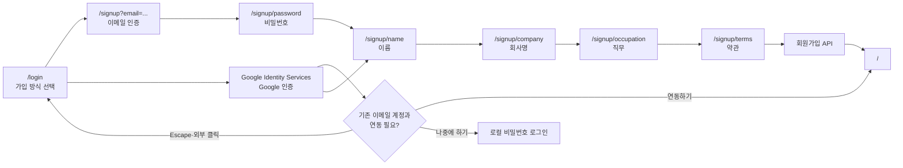

# 이메일 회원가입 플로우

이 문서는 이메일 회원가입의 구조와 주요 설계 결정을 빠르게 파악할 수 있도록 정리한 문서입니다.

## 먼저 볼 파일

아래 순서로 보면 전체 흐름을 가장 빠르게 이해할 수 있습니다.

1. [`signup-draft-store.ts`](../src/features/auth/signup-flow/model/signup-draft-store.ts): 단계 간 상태와 저장 범위
2. [`use-signup-step-guard.ts`](../src/features/auth/signup-flow/model/use-signup-step-guard.ts): 단계별 진입 조건
3. [`use-signup-email-verification-form.ts`](../src/pages/auth/signup-email-verification/model/use-signup-email-verification-form.ts): 인증 코드 발송·검증
4. [`use-signup-password-form.ts`](../src/pages/auth/signup-password/model/use-signup-password-form.ts): 비밀번호 검증과 다음 단계 이동
5. [`use-signup-terms-form.ts`](../src/pages/auth/signup-terms/model/use-signup-terms-form.ts): 최종 요청과 성공·실패 처리

## 사용자 흐름



- `/login`에서 이메일의 기존 로그인 수단을 조회합니다.
- 신규 이메일이면 `/signup?email=...`로 이동해 인증 코드를 발송합니다.
- Google 인증 결과가 `SIGNUP_REQUIRED`이면 일회성 `signupToken`과 프리필 이름을 메모리에 저장하고 `/signup/name`으로 이동합니다.
- 이메일 인증이 완료되면 비밀번호부터 약관까지 순차적으로 입력합니다.
- 마지막 단계에서 누적된 draft를 회원가입 API 요청으로 변환합니다.
- 성공하면 draft를 초기화하고 `/`로 이동합니다.

## FSD 배치

```text
app/(auth)/signup/**             Next.js route: FSD page를 re-export

src/features/auth/
  auth-form/                     인증 화면의 공통 form shell
  signup-flow/
    model/
      signup-draft-store.ts      단계 간 draft와 persist 정책
      use-signup-step-guard.ts   공통 진입 조건
    ui/
      signup-step-actions.tsx    이전/다음 버튼
      signup-agreement-fields.tsx

src/pages/auth/
  auth-entry/                    이메일 입력 및 가입/로그인 분기
  signup-email-verification/     인증 코드 발송·재발송·검증
  signup-password/               비밀번호 입력
  signup-name/                   이름 입력
  signup-company/                회사명 입력
  signup-occupation/             직무 선택
  signup-terms/                  약관 동의 및 최종 제출
```

- 여러 회원가입 화면에서 공유하는 상태·가드·UI는 `features/auth/signup-flow`에 둡니다.
- 각 화면에서만 사용하는 schema, form hook, API는 해당 `pages` slice에 둡니다.
- 루트 `app` 파일은 [`architecture.md`](./architecture.md)의 원칙대로 FSD page를 얇게 re-export합니다.

## 회원가입 draft

`useSignupDraftStore`는 단계 이동에 필요한 값을 Zustand로 관리합니다.

| 값 | 메모리 | `sessionStorage` | 비고 |
| --- | --- | --- | --- |
| 이메일 가입 인증 정보 | O | O | 이메일 및 인증 완료 여부 |
| 비밀번호 | O | X | 평문 브라우저 저장 방지 |
| Google `signupToken` | O | X | 일회성 가입 자격 증명 |
| 이름·회사명·직무 | O | O | 이전 단계 복원 |
| 약관 동의 | O | O | 실패 후 입력 유지 |
| hydration 상태 | O | X | redirect 시점 제어 |

비밀번호와 Google `signupToken`은 현재 탭의 React 앱 메모리에만 남습니다. 따라서 SPA 방식으로 이전·다음 단계를 이동할 때는 유지되지만, 새로고침하면 초기화됩니다. 이메일 가입은 `/signup/password`, Google 가입은 `/login`부터 다시 시작합니다.

store version 3의 migration은 과거 storage에 남아 있을 수 있는 `password` 필드를 제거하고 이메일 인증 정보를 가입 방식이 포함된 `identity`로 변환합니다.

다른 이메일로 회원가입을 시작하면 이전 draft를 초기화하고, 회원가입 성공 시에도 전체 draft를 초기화합니다.

## 단계 가드

각 단계는 persist hydration이 끝난 뒤 필요한 선행 값을 확인합니다.

| 현재 단계 | 필요한 선행 값 | 누락 시 이동 |
| --- | --- | --- |
| 비밀번호 | 인증된 이메일 | `/login` |
| 이름 | 이메일: 인증된 이메일·비밀번호, Google: `signupToken` | `/login` 또는 `/signup/password` |
| 회사명 | 인증된 이메일, 비밀번호, 이름 | `/login`, `/signup/password` 또는 `/signup/name` |
| 직무 | 인증된 이메일, 비밀번호, 이름, 회사명 | 누락된 첫 단계 |
| 약관 | 인증된 이메일, 비밀번호, 이름, 회사명, 직무 | 누락된 첫 단계 |

더 앞 단계의 값이 누락된 경우 가까운 직전 화면이 아니라, 실제로 다시 입력해야 하는 첫 단계로 이동합니다.

## 검증 정책

유효성 검사는 입력 중이나 blur 시점이 아니라 각 화면의 다음/제출 버튼을 클릭했을 때 수행합니다.

- 이메일·이름·회사명·비밀번호: React Hook Form과 Zod resolver
- 직무·이메일 인증 코드: 제출 handler에서 Zod `safeParse`
- 필수 약관: 필수 항목 동의 여부로 가입 버튼 활성화

Zod schema에 `trim()`이 있는 필드는 검증된 output을 store에 저장하므로 앞뒤 공백이 제거됩니다.

## 이메일 인증 상태

이메일 인증 화면의 로컬 상태는 reducer로 관리합니다.

```text
waiting
  ├─ 인증 실패/발송 실패 → error
  ├─ 재발송 성공       → waiting + 코드 초기화
  └─ 인증 성공         → verified
```

- 최초 진입 시 같은 이메일에 인증 코드를 한 번만 발송합니다.
- React Strict Mode의 effect 재실행으로 중복 발송되지 않도록 ref로 발송 이메일을 추적합니다.
- 이미 인증된 동일 이메일로 돌아오면 인증 코드를 다시 발송하지 않습니다.
- 인증 성공 후 다음 버튼을 누르면 `/signup/password`로 이동합니다.

## 최종 제출

약관 단계의 `useSignupTermsForm`이 가입 방식에 따라 draft를 `SignupRequest` 또는 `GoogleSignupRequest`로 변환해 제출합니다.

- 필수 약관 두 개가 모두 동의된 경우에만 제출할 수 있습니다.
- mutation 진행 중에는 이전/가입 버튼을 비활성화해 중복 제출을 방지합니다.
- 성공하면 draft를 초기화하고 `/`로 이동합니다.
- 실패하면 draft를 유지하고 API 오류 메시지를 화면에 표시합니다.

## Google Identity Services

Google 버튼은 `NEXT_PUBLIC_GOOGLE_CLIENT_ID`로 Google Identity Services를 초기화합니다. 이 값은 다른 시크릿과 동일하게 Doppler에서 주입하며 저장소에는 넣지 않습니다.

- `LOGIN`: BFF가 서비스 토큰을 암호화된 `HttpOnly` 쿠키에 저장한 뒤 `/`로 이동
- `SIGNUP_REQUIRED`: `signupToken`과 프리필을 저장하고 `/signup/name`으로 이동
- `LINK_REQUIRED`: 동일 이메일의 로컬 계정이 있으면 연결 확인 모달을 표시
  - `나중에 하기`: 기존 이메일을 유지한 채 로컬 비밀번호 로그인으로 이동
  - `연동하기`: `/api/auth/google/link`로 Google ID token을 보내고, BFF가 새 세션 쿠키를 저장하면 `/`로 이동해 성공 토스트 표시
  - Escape 또는 외부 클릭: 연결 여부를 선택하지 않고 모달 직전의 이메일 인증 진입 화면으로 복귀
  - 연결 요청 중에는 중복 요청과 중도 종료를 막기 위해 두 버튼과 모달 닫기를 비활성화

## 로그인 세션

로그인·회원가입으로 발급된 토큰은 Next.js BFF가 암호화된 HttpOnly 쿠키에 저장합니다. BFF를
통한 인증 API 호출, 세션 갱신, 접근 제어 및 보안 규칙은 [`auth.md`](./auth.md)를 기준으로
구현합니다.

## 테스트 위치

각 slice의 핵심 동작은 구현 파일 가까이에 테스트를 둡니다.

| 대상 | 주요 검증 |
| --- | --- |
| `signup-draft-store.test.ts` | persist 범위, 비밀번호 미저장, migration, 초기화 |
| `use-signup-step-guard.test.tsx` | hydration 대기, 선행 단계 redirect |
| 각 `signup-*-form.test.tsx` | 제출 시 검증, 값 저장, 이전·다음 이동 |
| `signup-email-verification-*.test.ts(x)` | 발송·재발송·검증 상태 전이 |
| `submit-signup.test.ts` | 최종 API 요청 |
| `signup-terms-form.test.tsx` | 필수 약관, 중복 제출 방지, 성공·실패 처리 |
| `auth-entry-page.test.tsx` | Google 연결 모달의 연동·보류·닫기 및 실패 처리 |
| `google-link.test.ts` | 연결 BFF의 요청 검증, 세션 저장, upstream 오류 처리 |
| `google-link-feedback.test.ts` | 성공 토스트 신호의 일회성 소비와 저장소 예외 격리 |
| `google-link-success-toast.test.tsx` | 연결 성공 신호가 있을 때만 홈 토스트 표시 |

검증 명령:

```bash
node --run fmt:check
node --run lint
node --run test:ci
node --run build
```

## 후속 작업

- 약관별 `보기` 버튼에 실제 약관 콘텐츠 또는 상세 화면을 연결합니다.
